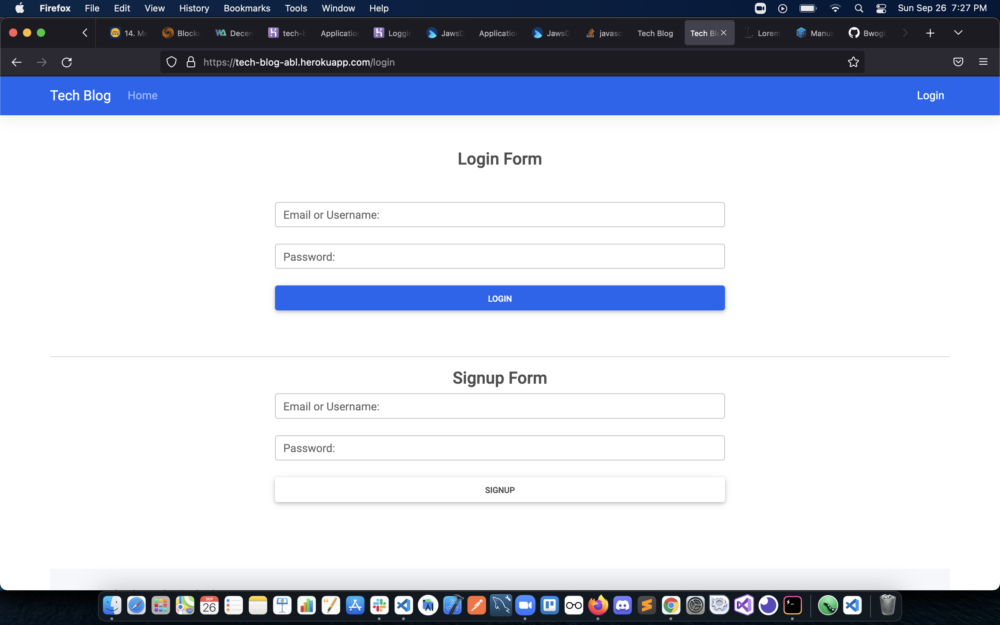

# tech-blog 
  <p align="left">
    
    
    
       
  </p>

  ## User Story
AS A developer who writes about tech
I WANT a CMS-style blog site
SO THAT I can publish articles, blog posts, and my thoughts and opinions
  ## Description
 Writing about tech can be just as important as making it. Developers spend plenty of time creating new applications and debugging existing codebases, but most developers also spend at least some of their time reading and writing about technical concepts, recent advancements, and new technologies.

 This is a CMS-style blog site, where developers can publish their blog posts and comment on other developers’ posts as well. Its built completely from scratch and deployed to Heroku. 

  ## Technologies
  It follows the MVC paradigm in its architectural structure, using Handlebars.js as the templating language, Sequelize as the ORM, and the express-session npm package for authentication. NodeJS for the backend and MySQL2 as the DBMS. DotEnv package helps store sensitive environment variables.

  ## Starter code
   

  ## Project Setup and Use
  * Clone the project source code
  * Connect to MySQL database
  With your own database credentials;
  ```$ mysql -u root -p``` 
  * Create the database schema
  ```mysql> source db/schema.sql;```
  * Exit the database
  ```mysql> exit```
  * Populate the database
  ```$ npm run seed```
  * Start the server
  ```$ npm start```

  ## Mockup
  Project demonstration in this video
  [](https://youtu.be/I6P_ZOr3no0)

  ## live site on heroku
  https://tech-blog-abl.herokuapp.com/login
  
  ## Project repository 
  https://github.com/bwogi/tech-blog
  
  ## License 
  [](https://opensource.org/licenses/MIT)<br />
  This app is covered under MIT license.

  ## Contributors
  Developed by Andrew Bwogi